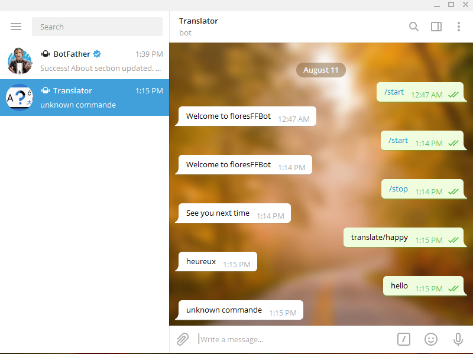
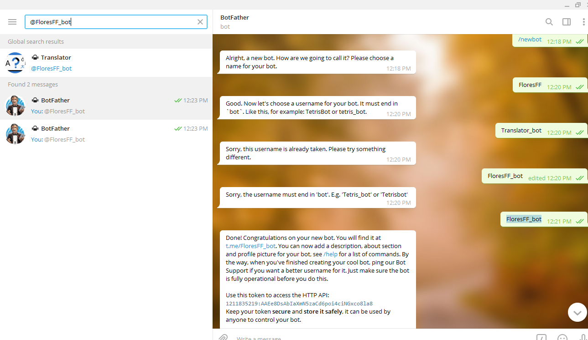
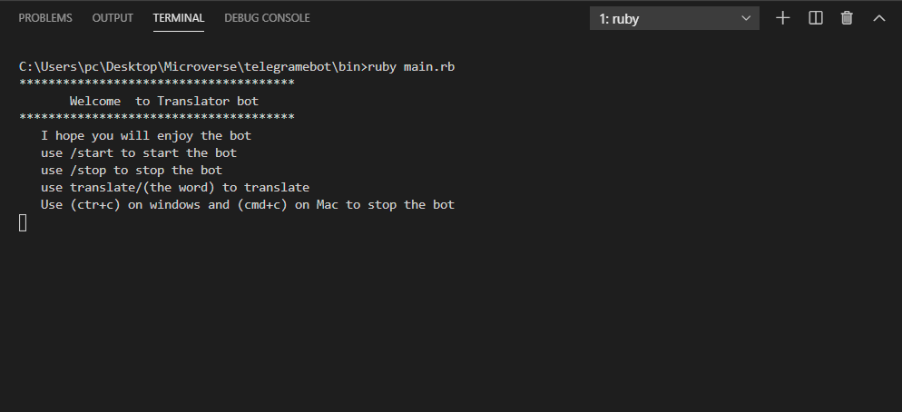
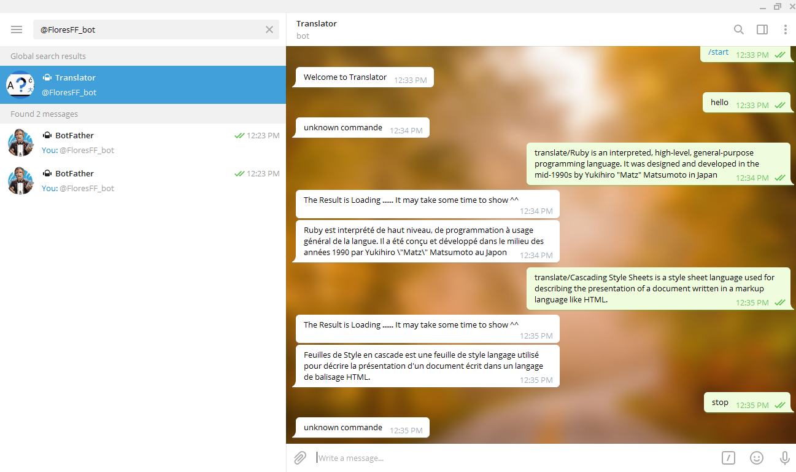

# Telegram-bot
Ruby wrapper for [Telegram's Bot API](https://core.telegram.org/bots/api).

This is Telegram_bot on [telegrame-messenger](https://telegram.org/) with the name of @FloresFF_bot it's a translator bot in order to translate from English to French built with Ruby .And this is my capstone Ruby  project 

 

## Built with 
-Ruby

## The repository link in repl.it

[Live Repo Link](https://repl.it/@RazikaRahal/telegramebot-1#bin/main.rb)

## How to Find the bot 

•	Click on the Link [link](http://t.me/floresFFBot)

•	In telegram, search for @FloresFF_bot

## Installation

## Install Ruby

We are going to use ruby program to write the code, it is necessary to install this program in your machine. 
In order to do so, Please read this ruby installation [documentation](https://www.ruby-lang.org/en/documentation/installation/?ref=hackernoon.com) and follow the instructions.

 ## Install Telegrame 
 
- Follow this link [Telegrame-messenger](https://telegram.org/)

## Choose you API

- Use the  API  [RapidAPI](https://rapidapi.com/Zinoudz/api/hirak-translate)

 ## Getting Started
1- In your terminal run git clone https://github.com/rahalrazika/telegramebot.git

2- cd telegramebot

3- create a .env file 

4- Copy the code in env_file.txt 

5- If you want a new token go to your telegram account and search for @BotFather. Press start and send the command /newbot. You will get a reply with all your bots information including your TOKEN in it. In our case, you don't need to create a new token you can simply search  for @FloresFF_bot in telegram app 

 

6- Run bundle -> To install all gems

## Start the bot 
Run bin/main.rb 

## Test with Rspec

- Run gem install rspec -> to install rspec
- Run rspec 

 ## How to use the bot 
 - Run bin/main.rb 

  

 - Open bot discussion on telegram app 

  

 ## Author

👤 **Razika**
​
- Github: [@rahalrazika](https://github.com/rahalrazika)
- Linkedin : [Razika Rahal](https://www.linkedin.com/in/razika-rahal-85539bbb/)
- Twitter: [@RereRere055](https://twitter.com/RereRere055)

##  Contributing

- To contribute to this project:
- Fork this repository & clone locally.
- Create an upstream remote and sync your local copy.
- create a new branch.
- Push your code to your origin repository.
- Create a new Pull Request .

## Show your support

Give a ⭐️ if you like this project!
​

## Acknowledgments

- Microverse 
- [telegram-bot-ruby](https://github.com/atipugin/telegram-bot-ruby)

